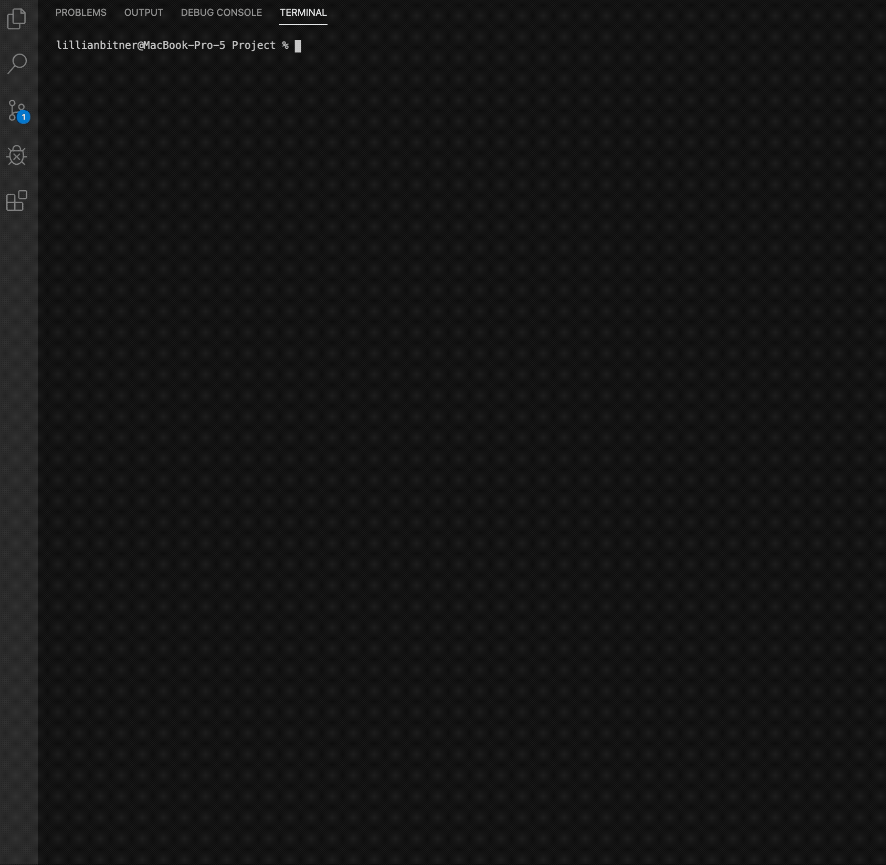

MOTIVATION

We both enjoy consuming pizza and we have strong opinions on what constitutes "good" pizza. We figured a database of actual Denver pizzas and reviews corresponding to them was needed. 

App utilizing ActiveRecord with database of Pizza information (restaurant, ingredients, menu name) in the Denver area.* The largest issue we had was with modifying the syntax of inputs to fit the function using the tty-prompt requirements.

*does not include all pizza in Denver 

FEATURES

1. write a pizza review
2. read a pizza review
3. delete a pizza review 
4. update a pizza review 
5. leave program 

TECH 

Ruby 2.6.1p33 

TESTS 

run ruby app.rb in command-line 
Follow CLI prompts 

FUTURE FEATURES 

1. A method to determine the pizza expertise of each reviewer, based on number of reviews
2. A method to determine the most popular pizza based on average rating for each pizza 
3. A method to score each review on its validity and truthfullness 
4. A method to find the review from a pizza characteristic input as opposed to review title 
5. A method to restrict other users from deleting reviews by others 

INSTALLATION 

Fork and clone down: 
https://github.com/lilbitner/Pizza-CLI-App- 

DEPENDENCIES 
"sinatra-activerecord"
"sinatra"
"sqlite3"
"rake"
"activerecord"
"require_all"
"pry"
"colorize"
"tty-prompt"

THANK YOU
Flatiron School in Denver!

